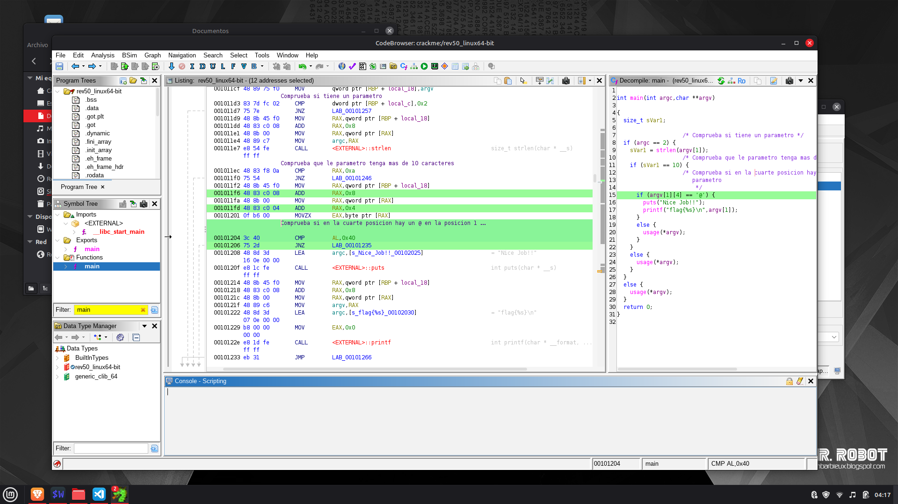

## CrackmeProject

This is a small **practice project** focused on learning **reverse engineering using Ghidra**.

The crackme used in this project is a **Linux binary** and was originally found as part of an online tutorial (YouTube).  
The main goal of this repository is **to document my learning process**, not to claim originality of the challenge itself.

At the moment this is just a basic example, but I plan to add **more advanced and original reverse engineering projects** in the future, without following step-by-step tutorials.

---

## 🧠 Project Goal

- Learn how to analyze Linux binaries (ELF)
- Get familiar with Ghidra interface and workflow
- Understand basic crackme logic (password checks, conditions, functions)
- Practice reading decompiled C-like code and assembly

---

## 🛠 Tools Used

- **Ghidra**
- Linux (x86 / x64)
- Basic knowledge of C and Assembly
- Terminal tools (strings, chmod, etc.)

---

## 🔍 Analysis Summary

In this project I analyzed the binary using Ghidra and focused on:
- Identifying the `main` function
- Locating the password check logic
- Understanding how user input is validated
- Following the program flow until the success / failure message

The solution was obtained by analyzing the logic, not by brute force.

> Note: The original binary is **not included** in this repository.

---

## 📷 Screenshots

Below is a screenshot taken during the analysis in Ghidra:

---

## ⚠️ Disclaimer

This repository is for **educational purposes only**.  
The analyzed crackme is a public learning challenge intended for reverse engineering practice.

No proprietary software, malware, or real-world exploits are distributed here.

---

## 📌 Future Plans

- Add more Linux crackmes
- Try harder challenges (anti-debug, obfuscation, etc.)
- Improve documentation and explanations
- Write my own simple crackme in C

---

Thanks for reading!
